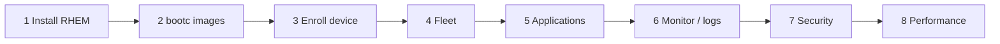

# RHEM EAP — hands-on labs

Follow-through labs aligned with the **Technical Use Cases** test plan. Each folder is one use case: open `lab.md`, run steps in order, paste outputs into `RESULTS.md` when done.

**Infrastructure prereqs (Proxmox + Terraform + Ansible):** see [`prereqs/README.md`](prereqs/README.md). Quick VM lifecycle from repo root: `make tf-up` / `make tf-down` — set `PROXMOX_VE_*` in the shell or in `prereqs/terraform/.env` (see `.env.example`).

## High-level flow

| # | Folder | Use case |
|---|--------|----------|
| 1 | [`labs/01-edge-manager-installation`](labs/01-edge-manager-installation) | Install RHEM on RHEL |
| 2 | [`labs/02-bootc-images`](labs/02-bootc-images) | Base + app bootc images → registry |
| 3 | [`labs/03-enroll-device`](labs/03-enroll-device) | Onboard device |
| 4 | [`labs/04-fleet-join`](labs/04-fleet-join) | Fleet + bootc swap to app image |
| 5 | [`labs/05-managing-applications`](labs/05-managing-applications) | Deploy container app |
| 6 | [`labs/06-monitoring-support`](labs/06-monitoring-support) | Metrics + must-gather |
| 7 | [`labs/07-security-compliance`](labs/07-security-compliance) | Security & compliance (EAP) |
| 8 | [`labs/08-performance-optimization`](labs/08-performance-optimization) | Performance (EAP) |

## Conventions

- **`lab.md`** — Markdoc-friendly Markdown (YAML frontmatter + steps). Copy commands from fenced blocks.
- **`RESULTS.md`** — Short questionnaire / sign-off; duplicate from `RESULTS.template.md` if you prefer a fresh file per run.
- Replace placeholders like `CHANGEME`, registry URLs, and hostnames before running.

## Optional: render Markdoc

If you add a Markdoc site later, use the root `markdoc.config.mjs` and point your bundler at these `lab.md` files.
