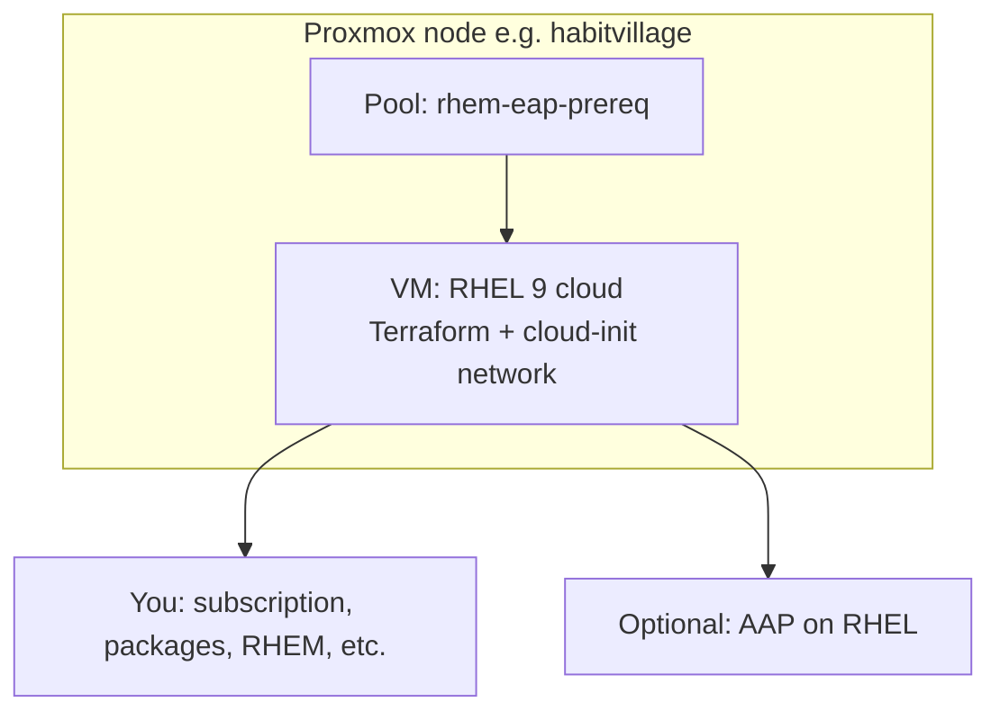

# What runs where (demo scope)

## What Terraform provides

**RHEL 9** from the KVM guest qcow2, SSH key for **`cloud-user`**, and **static IPv4 + gateway + DNS + search domain** on **`vmbr0`** (see [01-proxmox-terraform.md](01-proxmox-terraform.md)). Nothing else is installed on the guest.

## Red Hat Edge Manager 1.0 (you install when ready)

Standalone control plane: **[RHEM 1.0 on RHEL](https://docs.redhat.com/en/documentation/red_hat_edge_manager/1.0/html/installing_red_hat_edge_manager_on_red_hat_enterprise_linux/)** — RPMs `flightctl-services`, `flightctl.target`, Web UI on **`https://<DNS_Name>/`**, CLI/API on **`:3443`**, PAM issuer in Podman.

- Concise checklist: [docs/04-rhem-1-on-rhel.md](04-rhem-1-on-rhel.md) (manual steps only; no Ansible playbook in this repo)

## RHACM-integrated Edge Manager (alternate)

If you use **OpenShift + RHACM**, RHEM can run on the hub per [RHACM Edge Manager](https://docs.redhat.com/en/documentation/red_hat_advanced_cluster_management_for_kubernetes/2.13/html/edge_manager/edge-mgr-intro). See [docs/03-edge-manager-rhacm.md](03-edge-manager-rhacm.md) — this is **not** the same as RHEL RPM install.

## Proxmox isolation

Terraform only manages the **`rhem-eap-prereq`** pool and VMs you define here. It does **not** modify habitvillage project VMs or pools. Network defaults **follow** habitvillage’s L2/L3 pattern; see [network-habitvillage-parity.md](network-habitvillage-parity.md).
